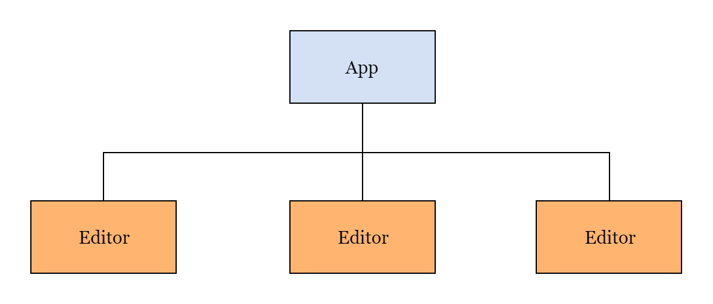

# codepen-clone-react
Simplistic clone of codepen.com editor using ReactJS.

Find deployed version [here](https://codepen-clone-462f6.web.app/) and alternative link - [here](https://codepen-clone-462f6.firebaseapp.com/), using Firebase deployment.

------------

## Components Breakdown

Excluding the React-Router-DOM components and the MaterialUI Icon Components, here is the component structure of the app -

### App Component
___
This is used to define the main page of the app and contains - 
* The editors - HTML, CSS and JS
* The preview panel
  
### Editor Component - `props={language, displayName, value, onChange}`
___
This component uses the open source _CodeMirror_ editor to provide the language editing features according to the passed in props. 

## App Logic
___
The **App** component stores the state of our html, css and js code in three separate variables, using the **useState** hook and also storing the information in the browser's local storage => all through our custom **useLocalStorage** hook, so that whenever the user reloads the page, the same code is available to him again.

The frontend code is then rendered onto the preview panel of the main page through the **srcDoc** attribute of the iframe tag.
We have set our code in such a way that the preview is refreshed only when the user stops typing for a duration of 1 sec.

The HTML, CSS and JS editors are handled using the Controlled CodeMirror Components from **react-codemirror2** npm package. We pass in the state values, handlers and the language types through the props from the App component, and use it as attributes in the CodeMirror components inside the Editor component.

